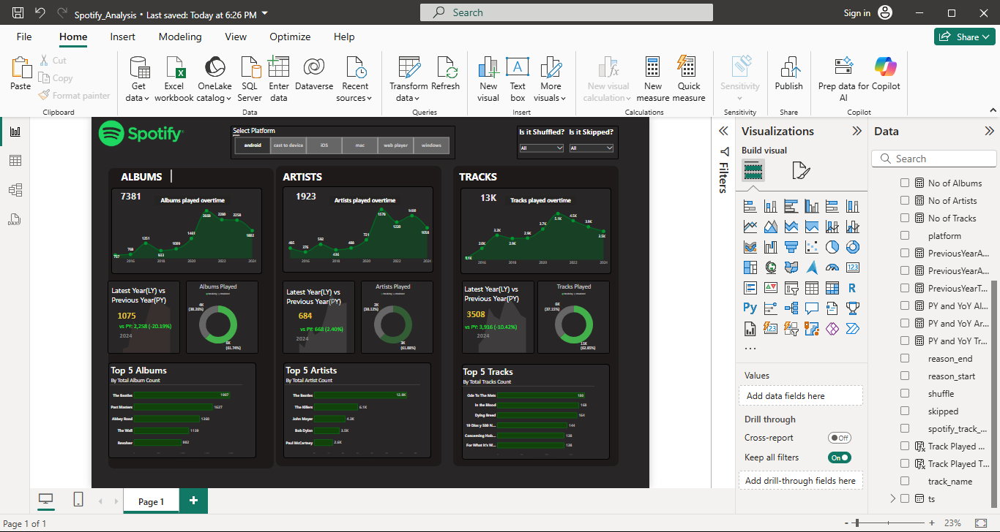

# SpotifyDashboardAnalysis
# 🎧 SpotifyDashboardAnalysis

A Power BI dashboard analyzing Spotify listening data from 2013–2024 to provide insights into music preferences and listening behavior over time.

---

## 📊 Dashboard Preview

> The dashboard highlights top artists, albums, and tracks based on play counts across the years.

---

## 📁 Project Files

- `Spotify_Analysis.pbix`: Power BI dashboard file with all visuals and data modeling
- `README.md`: Overview and documentation for the project

---

## 🔍 Key Insights

- 🎤 **Top Artist:** [The Beatles]
- 📈 **Peak Listening Year:** [2024]
- 🎶 **Most Played Genre:** [Rock n Roll]
- 📊 **Trends:** [Rise in hip-hop and Afrobeat post-2018]

---

## 🛠 Tools Used

- **Power BI** – For interactive data visualization
- **GitHub** – For version control and portfolio sharing

---

## 🚀 How to Use

1. Clone or download this repository
2. Open the `.pbix` file using **Power BI Desktop**
3. Explore the visuals, filters, and insights

---

## 📌 Notes

- Dataset was manually collected/exported
- Data covers Spotify listening history from **2013 to 2024**

---

## 📬 Contact

Created by **Michelle Warari**  
📧 wararimitchell@gmail.com  

---
